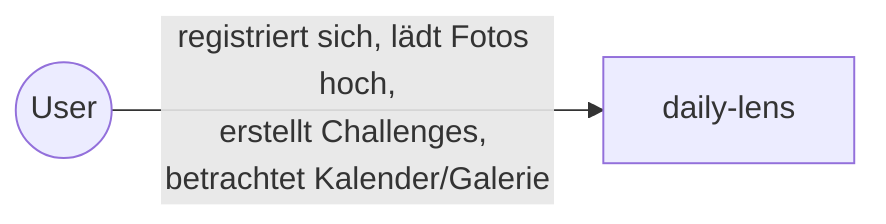
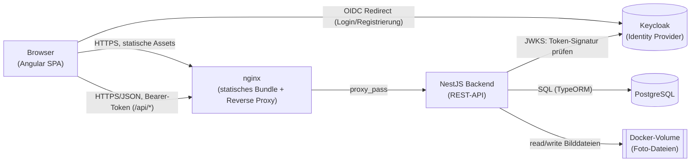
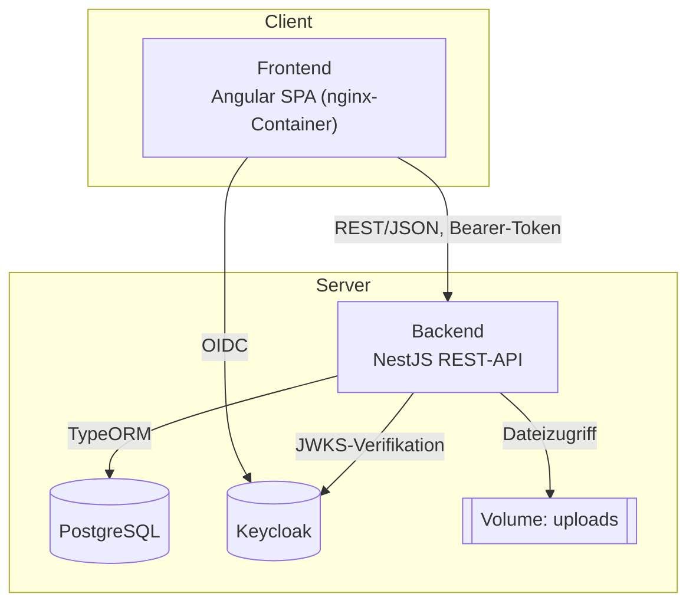
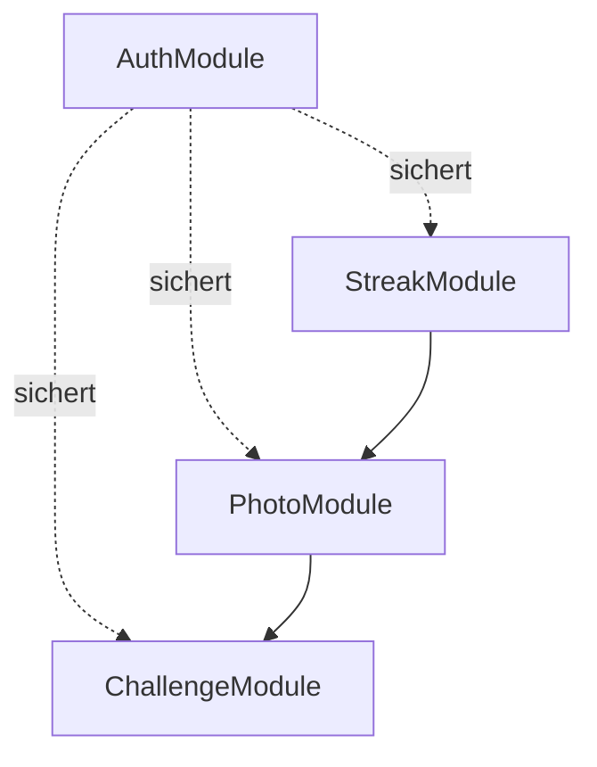
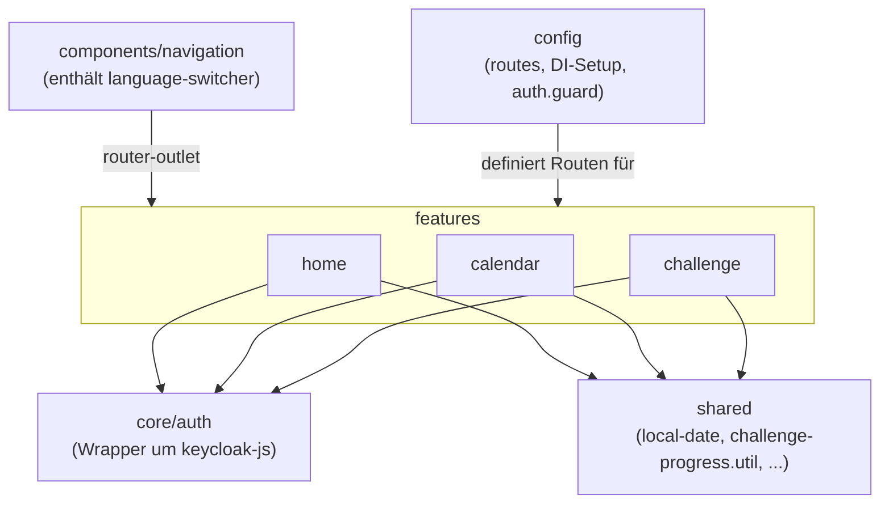
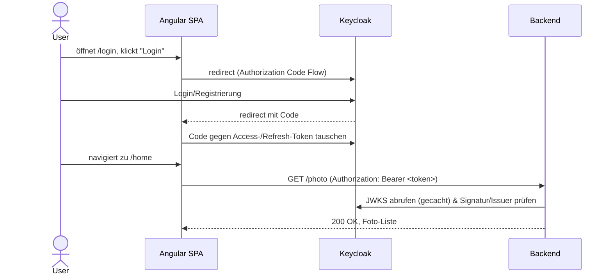
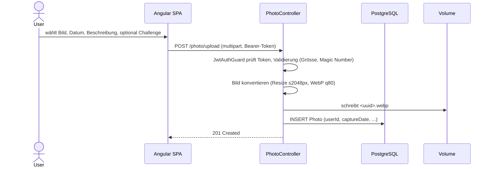
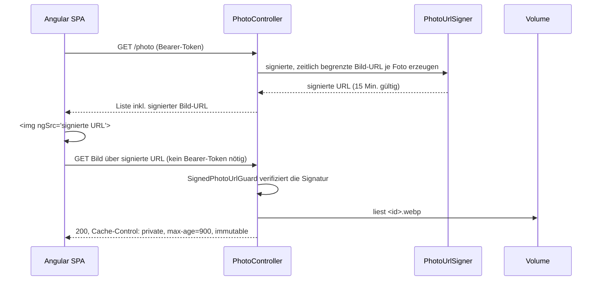
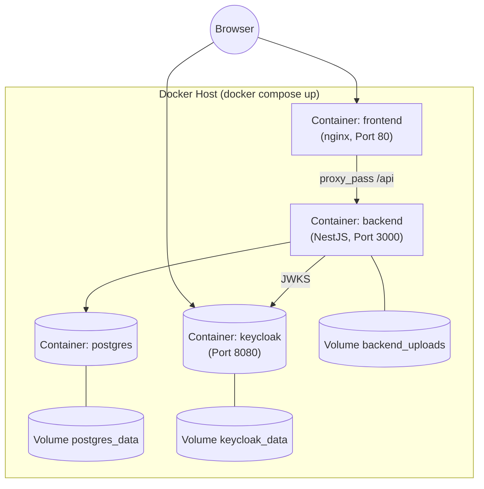

# Architekturdokumentation - daily-lens

## 1. Einführung und Ziele

daily-lens ist eine Webapplikation, die User dazu anregt, täglich ein Foto hochzuladen und sich zeitlich begrenzen Challenges zu widmen.
Zusätzlich existiert eine Kalenderansicht mit Streak-Funktion, damit die persönliche Routine besser sichtbar zu machen und zum Weitermachen motiviert.

Genaue Anforderungen stehen im [`Projektvorschlag.md`](./Projektvorschlag.md).
Die Modulvorgaben dazu stehen im Repository [web-programming-lab-projekt](https://github.com/web-programming-lab/web-programming-lab-projekt) (Stand 31. August 2026).

## 2. Randbedingungen

| Art | Randbedingung |
|---|---|
| Organisatorisch | Einzelarbeit, Zeitbudget ca. 60 Stunden (siehe [Arbeitsjournal.md](./Arbeitsjournal.md)) |
| Organisatorisch | Abgabe als GitHub-Repository, Architekturdokumentation zählt 30 % der Modulnote |
| Technisch | CRUD auf mind. einer selbstdefinierten Ressource, Daten persistent in einer DB, mind. zwei unterschiedliche Darstellungsformen der Daten (Modulvorgabe) |
| Technisch | Responsive für Mobile/Tablet/Desktop (Modulvorgabe) |
| Technisch | Automatisierte Unit-/Integrations-/E2E-Tests (Modulvorgabe) |
| Technisch | Lighthouse-Score ≥ 90, Mobile & Desktop (Modulvorgabe) |
| Technisch | Prod-Bundle reproduzierbar startbar, hier via `docker compose up` (Modulvorgabe) |
| Konvention | Formatierung und Linting über Prettier und oxlint, in der CI erzwungen |

## 3. Kontextabgrenzung

### 3.1 Fachlicher Kontext

Es gibt nur einen Akteur: der User im Browser.
Keine Anbindung an Drittsysteme.

### 3.2 Technischer Kontext

| Schnittstelle | Protokoll/Format | Zweck |
|---|---|---|
| Browser <> nginx | HTTPS, statische Dateien | Ausliefern des Angular-Bundles |
| Browser <> Backend (via nginx `/api/*`) | REST/JSON über HTTPS, Bearer-Token | Fachliche Operationen (Fotos, Challenges, Streak) |
| Browser <> Keycloak | OIDC (Authorization Code Flow) | Login, Registrierung, Token-Erneuerung |
| Backend <> Keycloak | HTTPS (JWKS-Endpunkt) | Verifikation der JWT-Signatur |
| Backend <> PostgreSQL | SQL | Persistenz der Metadaten zu Fotos und Challenges |
| Backend <> Volume | Dateisystem | Ablage der konvertierten Foto-Dateien (`<id>.webp`) |

## 4. Lösungsstrategie

### 4.1 Technische Entscheidungen

- **Frontend**: Angular
    - Begründung: Im Kurs am meisten Fokus & Wissen kann bei der Arbeit auch eingesetzt werden
    - Erfüllt Anforderung an JavaScript SPA
- **Backend**: NestJS
    - Begründung: TypeScript, Dependency Injection, Decorator Style (ähnlich wie Java Backends welche ich sonst schreibe)
    - Erfüllt Anforderung an JavaScript Backend
- **DB**: PostgreSQL
    - Begründung: einfach mit Docker
- **Authentifizierung**: Keycloak
    - Begründung: kann selbst gehostet werden
- **Testing Frameworks**: Unit/Integration: Vitest, E2E: Cypress
    - Begründung: Vitest: defacto Standard & ESM. Cypress: Im Kurs am meisten Fokus

### 4.2 Frontend Architektur

Das Frontend wird als SPA (Angular) umgesetzt.
Begründung: interaktive Ansichten (Kalender, Galerie) ohne Full-Page-Reloads und klare Trennung von Frontend und Backend über eine REST-API.

### 4.3 Backend Architektur

Das Backend wird als ein einzelner Monolith (NestJS) umgesetzt.
Begründung: Es ist eine kleine Applikation, und ein Monolith ist einfacher aufzusetzen und zu betreiben als mehrere Services.

### Struktur

**Frontend**
- nach Features
- strikte unterteilung in `smart_container` und `dumb_components`

**Backend**
- nach Features

## 5. Bausteinsicht

### 5.1 Whitebox Gesamtsystem (Level 1)

| Baustein | Verantwortung |
|---|---|
| Frontend (Angular) | Darstellung (Kalender, Galerie, Formulare), Routing/Guards, Login-Redirect zu Keycloak, i18n |
| Backend (NestJS) | REST-API, Validierung, Businesslogik (Streak-Berechnung, Bildkonvertierung), Autorisierung pro Ressource |
| PostgreSQL | Persistenz der Metadaten zu Fotos und Challenges |
| Keycloak | Identity Provider: Login, Registrierung, Token-Ausstellung/-Verifikation |
| Volume `uploads` | Persistenz der konvertierten Bilddateien |

### 5.2 Whitebox wichtiger Bausteine (Level 2)

**Backend**: ein Modul pro fachlicher Domäne (Controller -> Service -> Entity/DTO)

| Modul | Verantwortung |
|---|---|
| PhotoModule | Upload inkl. WebP-Konvertierung, CRUD, signierte Streaming-URLs |
| ChallengeModule | CRUD von Challenges |
| StreakModule | Streak-Berechnung aus den Aufnahmedaten der Fotos |
| AuthModule | JWT-Verifikation gegen Keycloak-JWKS, schützt die übrigen Module |

**Frontend**: je Feature ein Ordner, intern getrennt in `smart_container` (State, ruft `*.api.ts` auf) und `dumb_components` (reine Präsentation, kein HTTP)

| Baustein | Verantwortung |
|---|---|
| home | Foto-Upload, Foto-Liste, Streak-Anzeige |
| calendar | Kalender-/Zeitleisten-Ansicht der eigenen Fotos |
| challenge | CRUD von Challenges, Detail-/Galerie-Ansicht je Challenge |
| components | App-weite UI-Bausteine: `navigation` (Shell um `router-outlet`, Menü) und `language-switcher`|
| config | Routing & App Konfigurationen |
| core/auth | Login/Logout, Bearer-Token-Interceptor, Route-Guard |
| shared | domänenübergreifende Utilities (Datum, Challenge-Fortschritt) und Dialoge |

## 6. Laufzeitsicht

### Login/Registrierung (OIDC)

### Foto hochladen

### Foto anzeigen (signierte URL, ADR 1)

## 7. Verteilungssicht

- `docker compose up --build` im Repo-Root startet alle vier Container; Keycloak importiert den `daily-lens`-Realm automatisch beim Start
- Nur `frontend` (Port 80) und `keycloak` (Port 8080) sind nach aussen exponiert; `backend` ist nur intern erreichbar und wird über den nginx-Reverse-Proxy angesprochen
- Drei benannte Volumes für DB-Daten, Keycloak-Daten und hochgeladene Fotos überleben Container-Neustarts
- Für die Entwicklung startet `infra/docker-compose.yaml` nur Postgres + Keycloak; Frontend (`npm run start`) und Backend (`npm run start:dev`) laufen dann lokal mit Hot-Reload

## 8. Querschnittliche Konzepte

### Authentifizierung & Autorisierung

Keycloak ist der einzige Identity Provider (OIDC).
Das Backend hat keinen eigenen Session-Store: `JwtStrategy` prüft jedes Bearer-Token direkt gegen den JWKS-Endpunkt von Keycloak.
Jede Ressource (Photo, Challenge) hat eine `userId`-Spalte.
Bei jedem Zugriff wird zusätzlich geprüft, ob die Ressource dem anfragenden User gehört (`assertOwnership()` bzw. `WHERE userId = ...`).
Bei fremden Ressourcen kommt ein 404 statt 403 zurück, damit man von aussen nicht sieht, ob die Ressource überhaupt existiert.

### Validierung

DTOs (`PhotoDto`, `ChallengeDto`) werden mit `class-validator`/`class-transformer` deklarativ validiert (Datumsformat, Pflichtfelder, UUID); die Angular-Formulare spiegeln dieselben Regeln clientseitig.
Feldübergreifende Regeln (z. B. `endDate >= startDate`) werden im Service geprüft.

### Bild-Pipeline

Hochgeladene Bilder werden einmalig mit `sharp` normalisiert (max. 2048 px, WebP q80) und unter ihrer `id` abgelegt (ADR 4).
Weil sich der Inhalt einer `id` danach nie mehr ändert, kann `GET /photo/:id` lange gecacht werden: `Cache-Control: private, max-age=900, immutable`.

- `private`, weil die Bilder personenbezogen sind und nicht über Proxies/CDNs gecacht werden sollen
- `immutable`, damit der Browser bei einem Reload nicht nochmal nachfragt
- `max-age=900` (15 Min.), genau so lange wie die signierte URL gültig ist

Damit das Caching über mehrere Loads hinweg wirklich greift, muss die URL selbst stabil bleiben.
Dazu mehr im nächsten Abschnitt.

### Signierte Bild-URLs

Der Browser lädt ein `` über eine eigene, native GET-Anfrage, an die sich keine eigenen Header wie `Authorization` anhängen lassen.
`` kann also kein Bearer-Token mitschicken, deshalb ist `GET /photo/:id` nicht per `JwtAuthGuard` geschützt, sondern über eine signierte URL:

- `GET /photo` liefert pro Foto eine URL mit `exp`- und `sig`-Parameter, `sig` ist ein HMAC-SHA256 über `photoId + exp`
- `SignedPhotoUrlGuard` prüft beim Abruf, ob `exp` noch in der Zukunft liegt und `sig` stimmt
- `exp` wird nicht auf "jetzt + 5 Min." gesetzt, sondern auf ein 15-Minuten-Raster gerundet, damit `sign()` für dieselbe `photoId` innerhalb desselben Fensters immer dieselbe URL liefert. Sonst würde der Cache-Header oben nichts bringen, weil bei jedem Request eine andere Signatur in der URL stünde

So funktioniert `` weiterhin nativ, ohne dass das Frontend die Bilder selbst per Fetch laden und als Blob einbinden muss.

Das Muster ist unter "signed URL" bzw. "presigned URL" bekannt, siehe z. B.[Bytescale Signed URL](https://www.bytescale.com/docs/secure-urls/signed-urls) oder [Google Signed URLs](https://docs.cloud.google.com/storage/docs/access-control/signed-urls).

### Internationalisierung

`ngx-translate` mit DE/EN-JSON-Dateien, umschaltbar über den `language-switcher`.
Datumswerte laufen über eine zentrale Utility (`shared/local-date.ts`), um DE/EN-Formatunterschiede an einer Stelle zu behandeln.

### Testkonzept

| Ebene | Werkzeug | Umfang |
|---|---|---|
| Unit | Vitest (Backend), Angular/Vitest (Frontend) | `streak.util`, `photo-url.signer`, `assert-ownership`, `challenge-progress.util`, Komponenten-Specs |
| Integration | Vitest gegen echtes NestJS-Modul (`*.e2e-spec.ts`) | Photo-CRUD, Photo-Upload, Challenge, Streak, mit `FakeAuthGuard` statt echtem Keycloak |
| End-to-End | Cypress gegen vollen `docker-compose`-Stack (ADR 2) | Kompletter User-Flow: Registrieren → Foto hochladen → Anzeige → Logout |

Jedes Teilprojekt (`backend`, `frontend`, `e2e`) hat eine eigene GitHub-Actions-Pipeline (Format-Check, Lint, Build, Tests).
UI-Elemente, die im E2E-Test geprüft werden, bekommen ein eigenes `data-testid` statt über CSS-Klassen selektiert zu werden (ADR 2).

## 9. Architekturentscheidungen (ADRs)

### ADR 1: Signierte URLs für den Bild-Stream-Endpunkt

`` kann kein Bearer-Token mitschicken, daher wird `GET /photo/:id` nicht per `JwtAuthGuard`, sondern per kurzlebiger HMAC-signierter URL abgesichert.
Der Mechanismus ist in Kapitel 8 unter [Signierte Bild-URLs](#signierte-bild-urls) beschrieben.

### ADR 2: E2E-Test

Der Cypress-Test in `e2e/` läuft gegen den vollständigen `docker-compose`-Stack (Frontend, Backend, Postgres, Keycloak), nicht gegen `ng serve` mit gemocktem Backend.
Grund: Das Backend validiert Tokens live gegen den JWKS-Endpunkt des Realms, ein Mock würde genau diese Integration ungetestet lassen.
Vor allem Keycloak zu mocken hätte sich letztlich aufwändiger angefühlt als den ganzen Stack e2e zu testen.

Das Warten auf Stack-Bereitschaft steckt in `e2e/wait-for-stack.sh`, nicht in einem `docker-compose`-Healthcheck:
"Keycloak läuft" heisst nicht "Realm kann Login/Registrierung entgegennehmen".
Eine bessere Lösung dafür wurde auf die Schnelle nicht gefunden, das Skript pollt deshalb den Realm-Endpunkt, bis er antwortet.

Elemente, die im UI per E2E-Test geprüft werden, erhalten ein eigenes `data-testid`-Attribut statt über CSS-Klassen selektiert zu werden.
Das sollte die Tests robuster machen.

### ADR 3: Keycloak-spezifische Library statt generischem OAuth2/OIDC-Client

Im Frontend wird für Login/Auth `keycloak-angular`/`keycloak-js` eingesetzt statt einer generischen, Provider-unabhängigen Library wie `angular-oauth2-oidc`.
Begründung: Es handelt sich um ein kleines Schulprojekt, daher ist eine feste Abhängigkeit an Keycloak als IdP kein relevantes Risiko.
Im Gegenzug nimmt die Keycloak-spezifische Library viel Arbeit ab: Token-Refresh, Bearer-Interceptor und Route-Guard sind fertig integriert und müssen nicht selbst gebaut werden, was Login/Auth im Vergleich zu einer generischen OIDC-Library einfacher macht.

### ADR 4: WebP-Konvertierung beim Upload & Caching der Bilder

Kamera-Uploads sind oft mehrere MB gross und ziehen Ladezeit und Lighthouse-Score runter.
Deshalb werden Bilder beim Upload einmalig mit `sharp` konvertiert: auf max. 2048 px begrenzt, als WebP (Quality 80).
Pro Foto liegt danach nur noch eine `<id>.webp` auf der Disk, die zusätzlich über einen langlebigen `Cache-Control`-Header ausgeliefert wird.
Details dazu in Kapitel 8 unter [Bild-Pipeline](#bild-pipeline).

## 10. Qualitätsanforderungen

### 10.1 Qualitätsanforderungen im Überblick

| Qualitätsziel | Konkretisierung |
|---|---|
| Performance | Lighthouse-Score ≥ 90 (Mobile & Desktop); WebP-Kompression und Cache-Header für Fotos |
| Benutzbarkeit | Responsive für Mobile/Tablet/Desktop |
| Sicherheit | Zugriff nur mit gültigem Token; Fotos/Challenges strikt pro Account isoliert |
| Zuverlässigkeit | Unit-, Integrations- und E2E-Tests laufen automatisiert in der CI |
| Übertragbarkeit | `docker compose up` startet den kompletten Stack reproduzierbar |

### 10.2 Qualitätsszenarien

| # | Szenario | Antwortmass |
|---|---|---|
| 1 | User öffnet die App auf dem Handy | Lighthouse-Score ≥ 90 im Schnitt aller Kategorien, Mobile & Desktop |
| 2 | Jemand ruft `GET /photo/:id` eines fremden Fotos ohne gültige Signatur auf | `SignedPhotoUrlGuard` lehnt ab, keine Bilddaten werden ausgeliefert |
| 3 | Jemand versucht, eine fremde Challenge per `PUT /challenge/:id` zu ändern | `assertOwnership()` liefert 404, keine Änderung in der DB |
| 4 | Ein Refactoring führt versehentlich einen Bug in der Streak-Berechnung ein | `streak.util.spec.ts` schlägt in der CI fehl, der PR kann nicht gemerged werden |
| 5 | Bewertende:r klont das Repo frisch und führt `docker compose up --build` aus | Kompletter Stack (DB, Keycloak inkl. Realm, Backend, Frontend) läuft ohne weitere Handgriffe unter `http://localhost/` |
| 6 | Dasselbe Foto wird in derselben Session zweimal geladen (Navigation zurück/vor) | Bild kommt aus dem Browser-Cache statt vom Server (stabile signierte URL, `Cache-Control: immutable`) |

## 11. Risiken und technische Schulden

## 12. Glossar